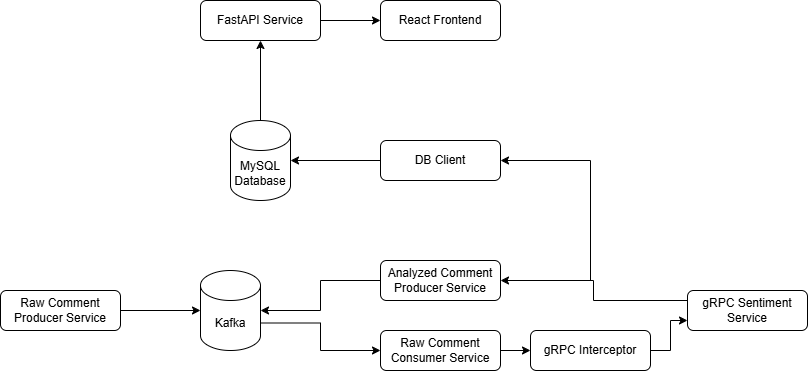

# Comments Production, Processing, and Presentation

## Overview

This project implements a microservices-based system designed to generate, process, and present customer comments in
real time. Randomly generated comments are produced with unique IDs and sent to Apache Kafka in a proto-formatted
binary. A consumer service retrieves these comments from Kafka and forwards them to a gRPC-based sentiment analysis
service. The gRPC service assigns a random sentiment (positive, negative, neutral) to each comment, simulating
processing. Once the sentiment is assigned, the processed data is sent as a proto-formatted binary to both a DB client
and an analyzed comment producer service. The analyzed comment producer writes the data to a separate Kafka topic, while
the DB client saves it in a MySQL database. Finally, the processed data is exposed via a REST API built with FastAPI,
allowing the frontend to retrieve and display the results.

## System Components

- **Raw Comment Producer Service:**  
  Produces random comments with unique IDs and sends them in proto-formatted binary to Kafka.

- **Raw Comment Consumer Service:**  
  Listens to the raw-comments Kafka topic, retrieves comments, and forwards them to the gRPC Sentiment Service.

- **gRPC Sentiment Service:**  
  Simulates sentiment analysis by assigning a random sentiment (positive, negative, neutral) to each comment. The
  service ensures that repeated analysis of the same comment yields the same result. It introduces a delay based on
  comment length and applies a rate limit (e.g., 100 requests per second); for rate limiting gRPC Interceptor class
  used.

- **Processed Data Distribution:**  
  Once sentiment analysis is complete, the processed binary data is sent both to the DB client and the Analyzed Comment
  Producer Service.

- **Analyzed Comment Producer Service:**  
  Writes the processed data to a separate Kafka topic.

- **DB Client:**  
  Saves the processed comments into a MySQL database.

- **REST API Service:**  
  Developed using FastAPI, this service exposes the processed comments (including commentId, original text, sentiment
  label) to the frontend.

## Technologies Used

- **Backend:** FastAPI, gRPC
- **Frontend:** React
- **Messaging:** Apache Kafka
- **Database:** MySQL
- **Architecture:** Microservices
- **Containerization:** Docker

## Project Diagram



## Setup

The system is dockerized for quick setup. Follow these steps to start all services:

1. **Prerequisites:**  
   Ensure that Docker is installed on your system.

2. **Project Directory:**  
   Open your terminal and navigate to the project directory.

3. **Start Services:**  
   Build and run all services using:
   ```bash
   docker-compose up --build
